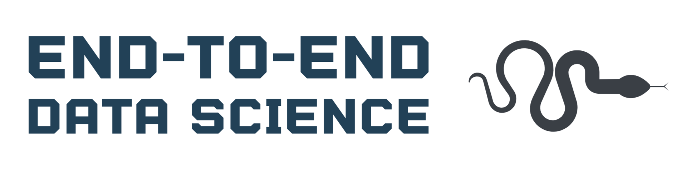

Personal Git repository to play with packages and test stuff out.

## Technologies

### Python
- Flake8
- Mypy
- Black
- Gin-config
- Poetry
- MLFlow

### Data Science
- Scikit-learn
- Scikit-lego
- Pytest

### Deployment
- MLFlow
- Docker

### CI / CD
- Github actions
- Dependabot
